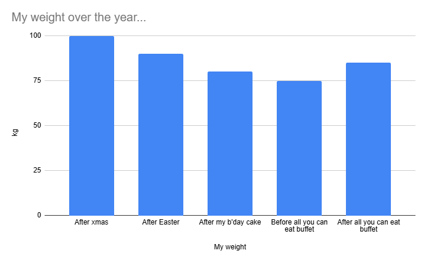
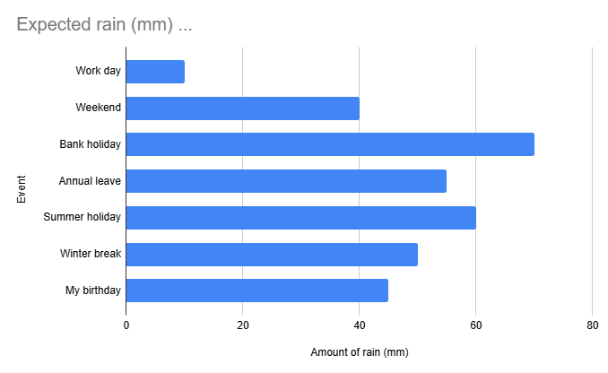
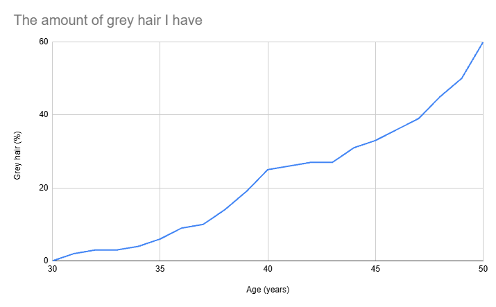
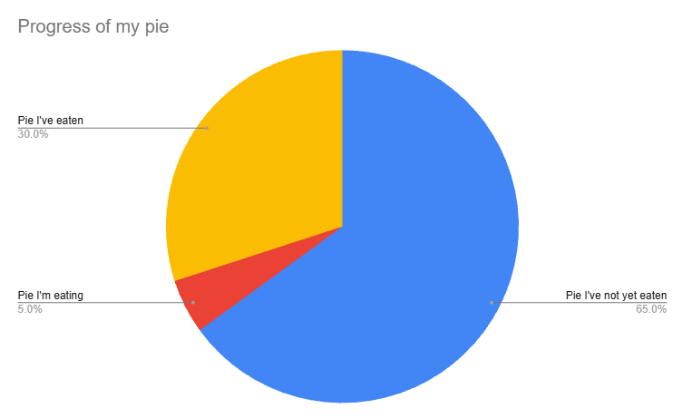
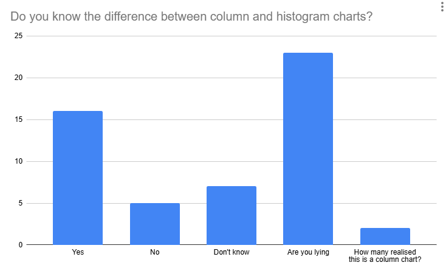
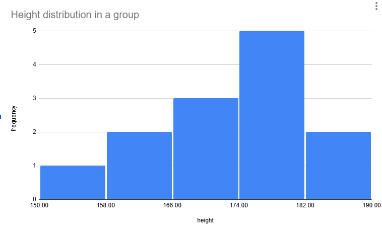
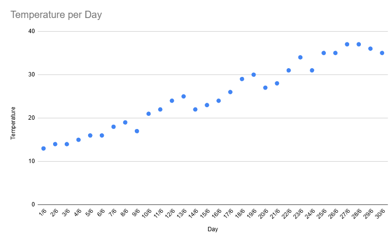
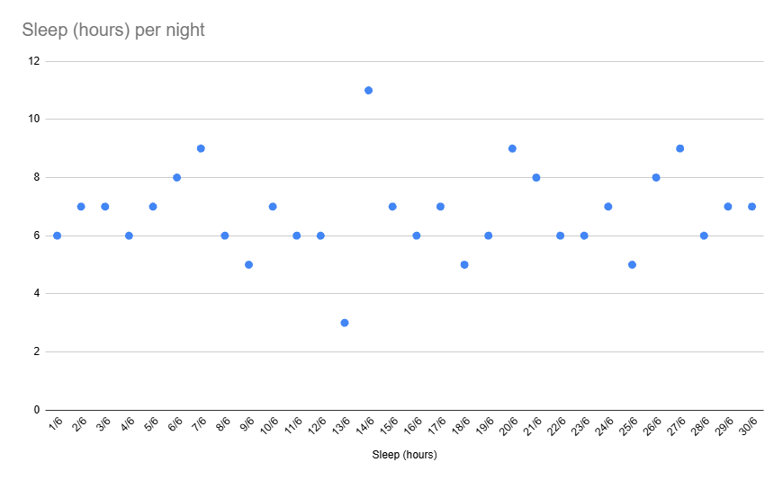

# What is Data?

- Approximately 402.74 million terabytes of data are created each day
- 181 zettabytes of data were generated in 2025
- Around 221 zettabytes of data is expected to be generated in 2026
  - A 22% increase in 1 year

[source](https://www.statista.com/statistics/871513/worldwide-data-created/)

>A Zettabyte is 1000x an Exabyte...  
>which is 1000x a Petabyte...  
>which is 1000x a Terabyte...  
>which is 1000x a Gigabyte...  
>which is 1000x a Megabyte...  
>which is 1000x a Kilobyte...  
>which is 1000x a Byte
>
>FYI a single MP3 is about 3-5 KB

## What Makes up this Data?

1. **Video (the largest category)**

Video is by far the biggest contributor to data growth, accounting for the majority of internet traffic. This includes:

- Streaming services (Netflix, Disney+, YouTube, TikTok)
- Video conferencing (Teams, Zoom)
- CCTV and security camera footage

Some estimates suggest video traffic represents around 80%+ of internet data traffic.

2. **IoT and Sensor Data**

Billions of connected devices continuously generate data:

- Smart home devices
- Industrial sensors
- Manufacturing equipment
- Smart meters
- Connected vehicles
- Wearables and health monitors

Each device generates small amounts individually, but collectively they produce enormous volumes of telemetry data.

3. **User Generated Content**

Data generated by users through:

- Social Media posts, including:
  - Photos
  - Videos
  - Posts and comments
  - Messages
  - Reactions and engagement metrics
- Forms we fill out when interacting with companies and organisations
- Data gathered and logged through our phones and smart devices

There is also data which can be inferred from the above, such as our personal preferences, likes and dislikes, and behavioral habits.

With billions of data generating people worldwide, these sources create a constant stream of new information.

4. **Business and Enterprise Data**

Organisations generate large quantities of:

- Transaction records
- CRM data
- Financial records
- ERP system data
- Emails
- Logs and audit trails
- Customer interaction data

Although critically important, enterprise structured data represents only a fraction of overall global data creation.

5. **AI-Generated Data**

An increasingly significant source is AI itself:

- LLM prompts and responses
- Synthetic training data
- Generated images, audio, and video
- AI application interaction logs

Generative AI is one of the factors IDC identifies as contributing to a richer and more complex global datasphere.

6. **Machine and System Logs**

Every digital system records operational data:

- Web server logs
- Application logs
- Cloud monitoring data
- Cybersecurity event records
- Network telemetry

Much of this data is never viewed directly by humans but is essential for monitoring and analytics.

7. **Images and Audio**

Including:

- Smartphone photos
- Medical imaging (X-rays, CT scans, MRI scans)
- Satellite imagery
- Voice recordings
- Podcasts
- Music streaming

These files are much larger than traditional text data and contribute substantially to growth.

### Summary

A reasonable high-level breakdown would be:

- ~60-80% Video
- ~10-20% Images and audio
- ~5-15% IoT, sensor, and machine telemetry
- ~5-10% Enterprise and transactional data
- A growing proportion from AI-generated content

A key point is that most of the world's data is now unstructured, meaning it consists of videos, images, audio, documents, logs, and sensor streams rather than neatly organised rows in databases and spreadsheets. Some industry estimates put unstructured data at 80-90% of all data generated.

This is one of the main reasons why the demand for data engineers, data analysts, and data scientists continues to grow; Specifically, the process of taking data from its raw state and using it to inform useful actions is the realm of data analytics; Organisations need people who can store, process, govern, and extract value from vast quantities of largely unstructured data.

## Using Data

In addition to gathering these vast quantities of data, we are increasingly reliant upon it, and the analysis of it, for our daily tasks, choices, and conveniences.

It is now increasingly rare for us to be not-connected; Whether at home, schools, work, or during leisure time, we're both generating and consuming data.

Among the uses for data in our daily lives are:

- Informing our decision-making:
  - We choose products based on reviews and recommendation data that we seek out.
  - We judge something based on recorded metrics such as speed, efficiency, comparative costs, and more.
  - Managers decide which products to stock based on observed patterns or trends.
  
    Many of our decisions are influenced by the output of data scientists, and increasingly, AI.

- Improving our processes and outputs:
  - Data revealing which of similar products are purchased more frequently can lead to improvements to those which are not chosen.
  - Simulations and modelling lead to improved structures in automotive aand mechanical engineering, as per [this example](https://www.supercars.net/blog/wp-content/uploads/2025/07/Bugatti-Tourbillon-08.jpg) showing how Bugatti are revolutionising the design of suspension components with AI and 3D printing.

- Tracking and predictions:
  - Both live data and historical data can provide value and enhance the functionality of the systems we rely upon. Live data is often used to populate dashboards, which can provide point-in-time insights into performance and health, for example:
    - Security analysts use dashboards to monitor abnormal behaviour, such as login attempts, password resets, access requests to data, etc. and react immediately if somethings symptomatic of a security breach is observed.
    - Software developers are able to monitor performance of applications and systems, such as response times, processing times, memory and CPU usage, and more to inform their ongoing development focus.
    - Business Analysts may use dashboards showing live sales data, customer volumes, and the impact of changes to quickly see the impact and effectiveness of promotions, and decide to tweak or expand the offering.
    - Self-driving cars can recognize and track hazards and take actions to avoid accidents.
    - All of the above data stakeholders can utilise the data and predictions generated by climate scientists to predict the impacts of weather on all aspects of their operations.

    One of the greatest benefits we can realize from analytics is the ability to track, isolate, and even predict events.

- Improved and enhanced visibility into behaviors and actions:
  - Data generated and shared by our devices are providing organisations with insight into how their products are used by their customers, the features which are most commonly used and most valuable to their users for future product development
  - Real time logistical information can be captured, allowing for greater efficiencies and optimisations, such as maximising the amount of deliveries that can be made by a courier by designing optimal routes. This data can also be shared with customers, improving customer satisfaction, and reducing missing and missed packages.
  
    This additional level of visibility enables managers to ensure that the right products are available for their customers in the shortest time possible.

## The Importance of Visualization

Visualisations are a key part of the role of a Data Analyst in order to make the insights they generate accessible and actionable by downstream stakeholders. Visualisations provide a way to represent the data which can be easily understood, and therefore able to inform decision making by people who would find it more difficult to do so from raw information.

There are various types of visualisation which are commonly used to illustrate data, the most common ones include:

- **Column charts**: One of the most common chart types for comparing categories, with differences between categories represented by different column heights. The different categories are labelled on the X-axis, with the values along the Y. 

  Some best practices for column charts include:
  - Limit the number of columns to ensure that distinct categories are clearly differentiated.
  - If categories are not inherently ordered (e.g. time-based), consider ordering them by ascending or descending values for easier identification of trends.
- **Bar charts**: Very similar to column charts, but categories are shown horizontally instead. They also provide easy comparison between categories, which are labelled on the Y-ais, with measurements on the X. 

  Best practices for bar charts mirror those for column charts.
- **Line charts**: Typically used for comparing two data sets where the relationship will change over time, for example product sales per month. Line graphs clearly show trends, and are useful when the number of data points is high. 

  Some best practices for line charts include:
  - You can add multiple lines to the chart, but ensure that you don't lose clarity
  - Ensure that there is a legend when plotting multiple lines
- **Pie charts**: Pie charts are another common type, used when the different categories represent parts of a whole, i.e. 100%. For example: "Of all cars sold in a month, how many were red?" or "On how many days in August did it rain?" 
  Best practices:
  - Limit the number of categories so that the segments may be easily compared - especially when there are multiple categories with similar values - it will be hard to differentiate visually between 12% and 14% on a pie chart for example.
  - Use contrasting colours for clear differentiation.
  - Ensure the categories add up to 100%
- **Histogram**: Used to show frequency distribution across a dataset; a histogram splits the value distribution into equal sized *bins* with each data point being placed into one of these bins in order to show how many values fall into each range.

  It is common for people to mis-read a histogram as a bar chart, so ensure that you make it clear through the story you're telling (more on stories later). 

  **This is a real histogram...** 

- **Scatter plots**: used for showing the distribution of datapoints from a large dataset, allowing you to easily identify outliers, clusters, and trends. Scatter plots will often include a *trend line* or *line of best fit* to aid in visualising any correlation. Sometimes the trend will be easy to identify 

  Sometimes a trend may be less obvious or not exist at all 

  Best practices for scatter plots:
  - Ensure that you have sufficient data points for trends or outliers to be identified
  - Add a trend line only when correlation exists

### Best Practices for all Visualisations

- Include a title
- Label your axis
- Consider where your axis start, ideally start at zero, but if the values are close you may wish to start at a different point to avoid having values that look *almost* identical, but ensure it is clearly labelled when you have done so.
- Don't make your visualisations too cluttered or busy - reducing the impact

## Visualisations Tasks

1. Using one of the following websites, or elsewhere, identify one poor visualisation to share with the group (choose a random one, not one from near the top, to avoid repetition).
2. Explain why it is a poor visualisation, and make an improved version using Excel (or another viz' tool).

- [https://viz.wtf/archive](https://viz.wtf/archive)
- [https://www.reddit.com/r/dataisugly/](https://www.reddit.com/r/dataisugly/)