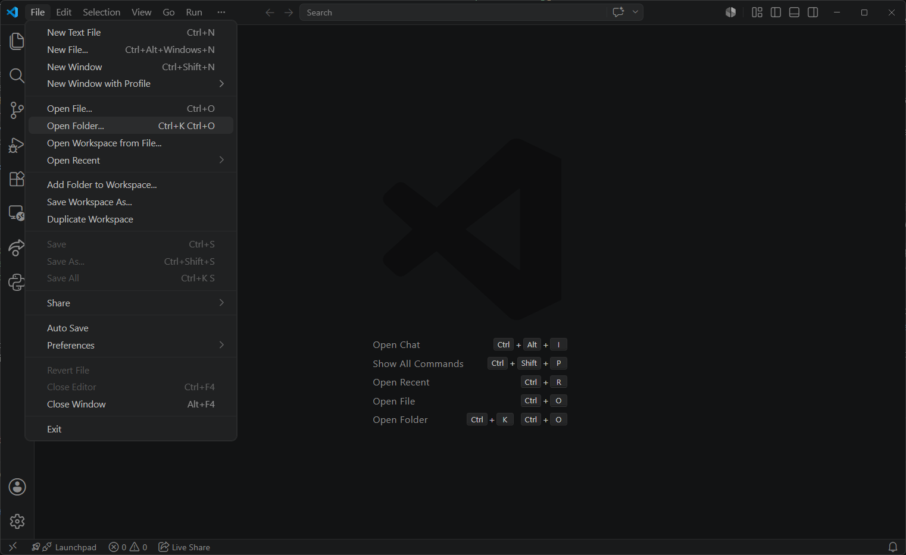
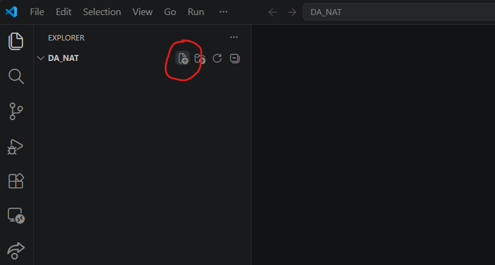
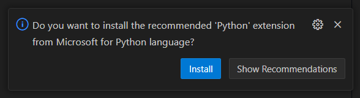
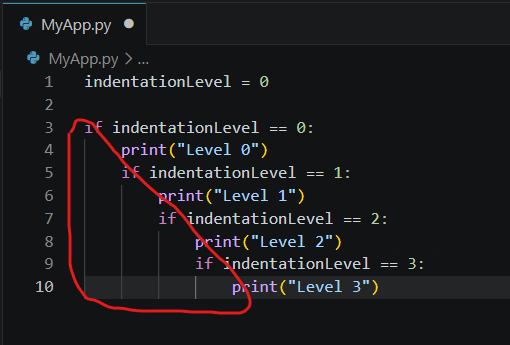

# Introduction to Python

## What is Python?

Python is a high-level programming language, which is accessible for beginners, but very powerful and flexible through the use of plugin modules, making it very popular for working with AI models, data science applications, and many other areas.

>Python is an interpreted language, which means when you run it the Python *interpreter* reads each line of code, in sequence, and translates the code into operations that the computer can process.

### What is Programming

Programming is the act of writing commands i.e. lines of code, which instruct the computer to carry out an operation. Computers operate on binary (1s and 0s), and of course humans don't, therefore we need abstraction layers to translate the instructions we type using Python commands, into binary operations the computer can run; we also rely upon translation layers in the other direction, to take binary output, and turn it into something humans can understand.

We can write programs to carry out a range of different operations, however they all share some concepts. They need to:

- Accept input, from the user, from events, from API calls, and more.
- Process the input, which may involve operating on the input, or it may be a trigger to process other elements.
- Access storage: fast RAM for the duration of the application's runtime; persistent storage if data needs to outlive the application.
- Produce some form of output. The output could be text based, graphics, audio, it may just be a confirmation, error message, or even just a status code.
- When working with **data**, we will usually be expecting either numerical output, or graphical output in the form of data visualisations.

### Installing Python and Visual Studio Code

Windows doesn't come with Python available by default, so we need to install it like any other application. If you have not already done so, download and install it now from [the python site](www.python.org).

>Do **NOT** write code in a word processor such as Word, because word processors include hidden characters to facilitate the different formatting you apply. These characters can be included when you copy/paste code, resulting in unexpected errors when running it.

Next we need an integrated development environment (IDE), and the most common one used in industry today is Visual Studio Code (VSC) which you can [download here](https://code.visualstudio.com/).

Next you need to create a folder (directory) for all of your Python work to keep things organised, then open this folder in Visual Studio Code.



To start writing some code we need to create a Python file, so with a folder open in VSC click the **new file** icon.


Name new file `MyApp.py` and press enter; as sooon as you do so VSC recognises that it is a Python file, and will prompt you to install the Python extension in the bottom right, we want this, so click
install.


You should now be ready to write some code. Test your Python installation by typing the following into your Python file, and running it with the Play symbol which should have appeared in the top right of VSC.

```py
print('Hello World')
```

This is the first line of code that every single developer writes, **it's the law!**. What do you think it did?

## Variables, Data Types, and Operators

The most foundational components when writing code are `variables`. Type the following into your Python file:

```py
age = 30
name = 'John'
is_adult = True
height_meters = 1.8
```

Variables are simply named containers for data, we can assign values to variables which we can then re-use over and over throughout our app. Variables **reduce repetition**, provide **consistency**, and **reduce errors** because relying upon humans to recall and type the same values over and over again is always going to be prone to errors.

We can assign any data we need to our variables using the `=` symbol. We can display the value of a variable using the `print()` command. 

Add the following below your variables to recall the value assigned to `name`:

```py
print(name)
```

Try changing your code to display the values of the other variables.

### Data Types

Python support a number of different data types, here are some of them:

- **Integers** - positive or negative whole numbers
- **Strings** - text data
- **Boolean** - `True` or `False`
- **Float** - positive or negative decimal numbers

Which three have you already seen?

<details><summary>Answer:</summary>

- Integer
- String
- Float

</details>

### Operators

We can utilise a range of built in operators against our variables. Below you can see examples of some of the most common arithmetic and comparison operators and how they can be used.

Try them yourself, but change the values of `a` and `b` to verify the operators work as you expect.

```py
a = 5
b = 10

# Print data types
print(type(a))
print(type(b))

# Arithmetic Operators - returns values
print(a + b)
print(a - b)
print(b / a)
print(a * b)
print(a ** b)
print(b % a)

# Comparison Operators - returns boolean
print(a == b)
print(a != b)
print(a > b)
print(a >= b)
print(a < b)
print(a <= b)
```

>Notice the hash symbol (`#`) is used to add comments to our code, these lines are messages to humans looking at our code usually explaining its purpose, Python doesn't try to execute them.

The below operators are used to quickly update the value of a variable:

```py
my_var = 10

# Three ways to add 5 to the my_var variable:
# 1.
add_num = 5
new_val = my_var + add_num
print(new_val)

# 2.
my_var = my_var + 5
print(my_var)

# 3. Using an Assignment operator
my_var += 5
print(my_var)

# More assignment operators:
my_var += 5 # add 5 to my_var
my_var -= 5 # subtract 5 from my_var
my_var *= 5 # multiple my_var by 5
my_var /= 5 # divide my_var by 5
my_var %= 5 # return the modulus of my_var / 5
my_var **= 5 # raise my_var to the power of 5
```

Try testing the above operators using your own values.

---

**End of lesson 1**

## Working with Strings

So far we've looked at integer values, but we also do a lot of work with strings (text).

Although some of the comparison and assignment operators can be used with strings, we do need to think about them differently. For example, numbers don't have upper and lowercase characters.

`Strings` are text based data, but that doesn't mean only letters and words, for example dates, times, and phone numbers are values we want to treat as text. We don't want to divide our phone number by two, or round it up. We need to ensure that Python knows these values are treated as strings.

Declare a string by enclosing it in single `' '` or double `" "` speech marks.

```py
print("Hello world") # we don't need to declare a variable to create a string

my_string = 'Goodbye moon' # but we can assign a string to a variable
print(my_string)

# Use either single or double quotes, choose based on the punctuation you need within your string
string_1 = "Ant's dogs are mini-dachshunds"
string_2 = 'Ant said "my dogs are mini-dachshunds"'

print(string_1)
print(string_2)
```

Try out the above examples using your own strings.

### String Concatenation

Concatenation is a techy word for linking things together; if we add two numbers together we get a new number, but if we add two strings together (concatenate them) we get a new longer string, comprised of the originals.

```py
a = "hello "
b = "world"
print(a + b)

# the below code does the same thing
c = "goodbye "
c += "moon"
print(c)
```

Concatenation allows us to combine several short strings into one longer one.

```py
a = "Frankie"
b = "Scout"

print("Ant's dachshunds are called " + a  + " and " + b)
```

>Notice the spaces after "called " and around the word " and ". Try removing them and see what happens to the output.

### Mixing Data Types

The following code will fail, try running it and identify why:

```py
a = "Frankie is "
b = 6

print(a + b)
```

<details><summary>Answer:</summary>

It failed because we cannot concatenate strings with different data types.

</details>

To prevent this error we need to change the **integer** into a **string** within our code, we can do this using `str()` (short for string).

```py
a = "Frankie is "
b = 6

print(a + str(b))
```

>The opposite transformation, i.e. **string** > **integer** can be done using `int()`

### String Interpolation and f-strings

In the last lesson we looked at string concatenation, which involves making a new longer string by adding shorter ones together. There is an alternative method that will provide the same output, called f-strings (formatted strings).

The below example will print the same message twice, once using concatenation, and once using an **f-string**.

```py
a = "Frankie"
b = "Scout"

print("Ant's dachshunds are called " + a  + " and " + b)
print(f"Ant's dachshunds are called {a} and {b}")
```

F-strings are a more modern approach, and allow you to embed your variables without opening and closing your strings frequently. However, there is another way that f-strings make life easier, which is that they don't require you to specify or change the data type. 

The below code will fail, can you make it work?

```py
a = "Frankie"
b = "Scout"
age_a = 6
age_b = 3

print(a + " is " + age_a + " and " + b + " is " + age_b) # This code fails
```

<details><summary>Answer:</summary>

`print(a + " is " + str(age_a) + " and " + b + " is " + str(age_b))`

</details>

Here is the same code using an f-string:

```py
a = "Frankie"
b = "Scout"
age_a = 6
age_b = 3

print(f"{a} is {age_a} and {b} is {age_b}") # This one succeeds
```

To make the first example work you needed to explicitly convert the numeric values into strings using the `str()` method, but when using an f-string you did not, this is because f-strings carry out interpolation, not concatenation.

Think of f-strings like filling in the blanks in your main string with any variable you want, whereas concatenation is joining individual strings together.

### String Methods

There is one more important concept to understand early on, it applies to many different object types in Python, called `methods`. Methods are the built in functionality available to the objects we create, there are different methods available for lists, for dictionaries, and in this below case, strings.

```py
name = "rick james"

print(name.upper()) # Convert to uppercase
print(name.title()) # Capitalise every word
print(name.split(" ")) # Split at the specified separator and return a list
```

There are many more string methods you can review here: [W3Schools](https://www.w3schools.com/python/python_ref_string.asp)

### Input and Output

To make our code interactive and allow us to pass data into it, we can use it the `input()` function. As Python interprets each line, when it encounters the `input()` function it pauses, and waits for the user to provide some data; When the user provides the requested input and presses **enter** the app continues.

To improve the user interface we can provide a prompt-string in the input function to let the user know what is expected.

```py
name = input("Please enter your name\n>")
# Notice the 'escape character' `\n` which doesn't print out, but does affect the output, in this case it starts a new line.

print(f"Nice to meet you {name}, would you like to play a game?")
```

Once we have captured the user input, we can then assign it to a variable, and process that input like any other value.

Use the above syntax to write your own `input()` prompt, and **interpolate** the input into some output using an f-string.

---

**End of lesson 2**

## Lists and If Statements

So far we've been working with and assigning single values to our variables. **Lists** are containers in which we can store zero or more ordered values.

The elements in a list can be any data type, even mixed types within the same list, and the elements within are ordered by their **index** number.

### List Indexing

Elements in a list (and in other data structures) are automatically assigned an index number according to their place in the list. 

>**IMPORTANT**: Because computers start counting at zero, the first indexed item is index 0, the next is index 1, and so on. Because the first item is not `item 1`, this is a common cause of unexpected output. It's so common that it's referred to as an *off by one error*.

```py
empty_list = []
numbers_list = [1, 2, 3, 4, 5]
people_list = ["Ant", "Rachel", "Segun", "Sarmistha"]
mixed_types = ["Cake", 43, 6.0, "Brown", True]
# Notice the syntax - declare a list using square brackets, each element is separated by a comma
```

The index number allows us to retrieve single or multiple items from a list using the syntax: `list_name[index_number]`

```py
people_list = ["Ant", "Rachel", "Segun", "Sarmistha"]
# retrieve individual items with 
print(people_list[0])
print(people_list[1])
print(people_list[2])
print(people_list[3])
# sometimes you might not know how long your list is, so you can also use minus numbers to wrap round to the back, '-1' is one from the end, '-2' is two from the end, and so on.
print(people_list[:-1])
print(people_list[:-2])
```

Write your own list and practice retrieving specific items by their index number.

### Slicing a List

We can use the index numbers to select multiple adjacent items at once, called a `slice`. To take a slice we provide the start and ending indexes, separated by a colon `[x:y]`

>**IMPORTANT**: The slice starts at the first index number, and stops at the second, which is not included in the output; this is another example of the *off-by-one error*, incorrect indexing referencing can produce unexpected results.

```py
people_list = ["Ant", "Rachel", "Segun", "Sarmistha"]
# retrieve a slice with:
print(people_list[1:3])
# if you omit the first or last index your slice will go to the beginning/end
print(people_list[2:])
print(people_list[:3])
```

>Lists are a powerful and commonly used Python data type. We can use them for storing values we want to retrieve, but also values we want to process. Loops allow us to process values in the list automatically - we'll return to loops in the next lesson.

### Populating an Empty List

We often start with an empty list which we want to populate during the running of our code. For example imagine I was making a pizza ordering app, and needed a list to hold the toppings a customer wants.

Below we're combining a few different concepts we've covered so far to fill an empty list.

```py
names_list = [] # Create an empty list

# Capture 3x names
first_name = input("Enter your name\n>")
second_name = input("Enter your name\n>")
third_name = input("Enter your name\n>")

# Confirm the list is empty
print(names_list)

# Add names to list using the append() method
names_list.append(first_name)
names_list.append(second_name)
names_list.append(third_name)

# Confirm the list is now populated
print(names_list)
```

Earlier we saw some string methods, in this code we used a list method called `append()` which adds a new item to the end of a list. Review some more list methods at [w3schools](https://www.w3schools.com/python/python_ref_list.asp)

The previous code above is very poor! How could it be improved?

<details><summary>Answer:</summary>

Reduce repetition with loops - to be covered in the next lesson

</details>

## If statements

So far our lines of code have been processed in order, from the top of our Python file to the bottom. However, we quickly discover limitations to this approach, because there is only one path from start to end, so our code cannot account for different scenarios. How do we write code that does different things depending upon the option the user selects? 

**If statements** allow us to make decisions in our code, by providing different outputs depending upon the result of a test you can define. If the outcome of the test is `True` then one block of code runs; If the outcome is `False`, then a different block is executed.

The most commonly used tests will utilise the comparison operators that we reviewed earlier, but more complex tests can be created. However, the output of your test should always be a boolean value (True/False).

We can use `if` and `else` statements to run different lines of code depending upon the output of the test in the if statement.

```py
age = int(input("Please enter your age: "))

if age < 29:
    print("You're Gen-Z")
else:
    print("You're old!'")
```

>Notice the input received from the user is always received as a string, therefore we need to convert it to an integer using the `int()` method in order to compare it with the number 29.

Can you identify the test which dictates which line of code runs?

<details><summary>Answer:</summary>

The test is: "`age` is **less than** (`<`) `29`".  
If the outcome is `True` "You're Gen-Z" is printed.  
Else, if the outcome is `False` "You're old!" is printed.  

</details>

We can provide more than two possible outputs for our if statements by using `elifs` (else-if)

```py
age = int(input("Please enter your age: "))

if age < 30:
    print("You're Gen-Z")
elif age < 46:
    print("You're a Millenial")
elif age < 62:
    print("You're a Gen-X")
else:
    print("You're a Boomer")
```

### Indentation

Reviewing our previous examples again, notice that each line following an if statement is indented from it's parent.

```py
age = int(input("Please enter your age: "))

if age < 30:
    print("You're Gen-Z")
elif age < 46:
    print("You're a Millenial")
elif age < 62:
    print("You're a Gen-X")
else:
    print("You're a Boomer")
```

This is how Python (and other environments) identify which lines of code are related. In this case when one of the conditions evaluates to `True`, the indented line of code is run, but if it's `False` the indented line is skipped.

>Because the required code only runs if the indentation is correct, **indentation errors** are common. Many IDEs like VSC give you visual hints to show indentation alignment.



### Logical Operators

Used in many places, but particularly in if statements, logical operators allow us to combine multiple conditional operators to create more complex tests.

|Operator|Description|Example|
|---|---|---|
|`and`|true if both conditions are true|`x > 5 and x < 10`|
|`or`|true if at least one condition is true|`name == 'Fred' or name == 'Ahmed'`|
|`not`|reverse the result i.e. if `x` exists return false, and vice-versa|`not x`|

A common tool to understand logical operators is to look at [Binary Truth Tables](https://www.realdigital.org/doc/e127ebfa82dbc904b5c0dac5d1adce8e)

Examples:

```py
age = 17
film_rating = 15

if (age < 18 and film_rating == 18): # Both conditions must be true
    print("You're too young, this film might disturb you!")
else:
    print("Come on in, the trauma is on you!")
```

We can also use logical operators to simplify complex if statements

```py
age = 17
film_rating = 15
# '/' means continue on next line rather than having it all on one, makes code easier to read
if  (age < 12 and film_rating == 12) or \ 
    (age < 15 and film_rating == 15) or \
    (age < 18 and film_rating == 18):
    print("You're too young, this film might disturb you!")
else:
    print("Come on in, the trauma is on you!")
```

Some of the last examples we've used have started to relate a bit more to the real-world: giving different responses to different people; checking film ratings. If statements are one of the ways we can start to represent or **model** more complex scenarios through our code.

## Exercises

Below are some exercises to reinforce some of the different concepts we've covered.

- [variables exercises](./exercises/variables-exercise.md)
- [lists exercises](./exercises/intro-lists-exercises.md)
- [python exercises](./exercises/python-1-exercises.md)
